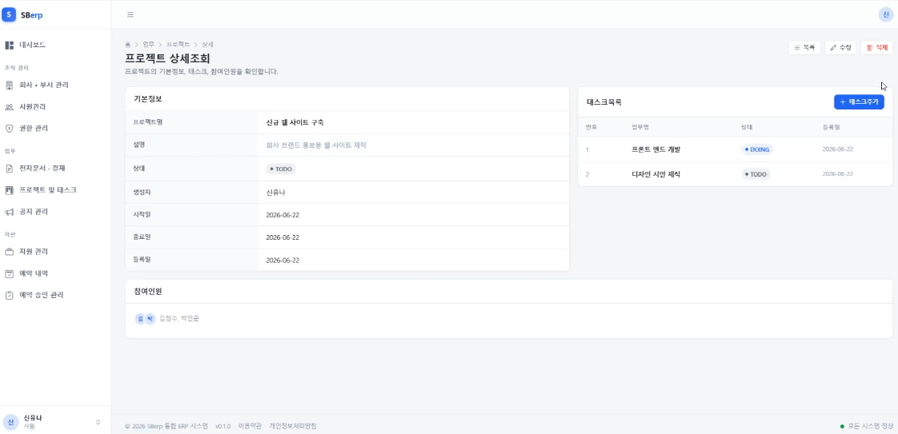
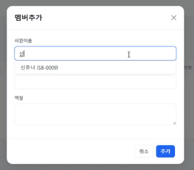

# SBerp v1 — 프로젝트/태스크 관리 모듈

6인 팀으로 진행한 사내 ERP 프로젝트(spring-breeze) 중, 제가 처음부터 끝까지 설계·구현한 프로젝트/태스크/프로젝트멤버 모듈만 따로 정리한 저장소입니다. 
팀 전체 코드→ https://github.com/yoonguri988/spring-breeze-erp

## 📌 프로젝트 개요

| 항목 | 내용 |
|---|---|
| 프로젝트명 | SBerp (spring-breeze-erp-v1) |
| 팀명 | spring-breeze |
| 개발 기간 | 2025.06.11 ~ 2025.06.26 (16일) |
| 팀 인원 | 6명 |
| 도메인 | Enterprise Resource Planning |
| 모듈 수 | 8개 (결재 · 공지 · 자원 · 사원 · 프로젝트 · 회사 · 부서 · 권한) |
| 대상 사용자 | 중소 규모 기업 관리자 / 임직원 |
| 담당 범위 |: 프로젝트 / 태스크 / 프로젝트멤버(참여 사원) |

### 기획 의도
- **자원 통합**: 회사 · 부서 · 사원 · 자원 · 예약 · 프로젝트 · 결재 · 공지까지 흩어진 기업 데이터를 하나의 시스템에서 관리
- **권한 분리**: 로그인, 강제 비밀번호 재설정, 비밀번호 분실 본인확인 등 안전한 인증 흐름 설계
- **협업 강화**: 프로젝트 · 태스크 · 참여 사원 구조로 팀 단위 업무를 가시화하고 추적

## 🛠 기술 스택

**Frontend (View Layer)**
- JSP (server-side view)
- HTML5 / CSS3 / JavaScript
- Bootstrap 5
- jQuery (Ajax)

**Backend (Server Layer)**
- Java / Spring (MVC)
- MyBatis (ORM Mapper)
- Apache Tomcat
- Session 기반 인증

**DB & Tools**
- MySQL 8.4.9
- MyBatis Mapper XML
- Git / GitHub
- Figma (UI 설계)
- ERDCloud (ERD 설계)
- Lombok / Maven
- Notion (협업)

## Features
- 프로젝트 CRUD — 등록/조회/수정/삭제, 상태·이름·기간별 조건 조회 → 다양한 조건으로 원하는 프로젝트를 빠르게 찾아낼 수 있는 조회 기능 제공 

- 태스크 CRUD — 프로젝트와 연계하여 등록/조회/수정/삭제 관리 → 프로젝트 하위에서 태스크 단위로 진행 상황을 세분화해 관리 가능
- 프로젝트 참여 사원(project_member) 관리 — 프로젝트-사원 N:M 매핑 구조로 참여 사원 추가/삭제 → 한 사원이 여러 프로젝트에, 한 프로젝트에 여러 사원이 참여하는 실제 조직 구조를 그대로 반영 

- 권한별(RBAC) 접근 제어 — 역할에 따라 프로젝트 수정·삭제 가능 여부 제어 → 권한 없는 사용자의 임의 수정·삭제를 사전에 차단
- 사원 자동완성 검색 — 프로젝트멤버 등록 모달에서 vanilla fetch 기반 사원 검색 자동완성 → 사번/이름을 직접 

- 공통 디자인 시스템 적용 — SBerp 커스텀 디자인 시스템 CSS 클래스를 전체 화면에 적용 → 모듈 전반의 UI 일관성 확보
  
ERD
project ── project_member ── employee
   │
   └── task

project, project_member, task 3개 테이블 기준으로 설계했고, 회사 단위 멀티 테넌시(com_id) 구조에 맞춰 상위 company 테이블과 연결됩니다.

Troubleshooting

연쇄적으로 발생하던 400/500 에러

문제: 뷰(JSP) · 컨트롤러 · MyBatis 매퍼 등 여러 계층에 걸쳐 원인이 얽혀 있어 파악이 어려웠음
해결: 계층별로 하나씩 재현하며 순차적으로 원인 추적 및 디버깅
결과: 프로젝트/태스크 모듈의 기본 CRUD 흐름 안정화
Related Repositories
v2 (Spring Boot 전환): 
v3 (REST API + AI): 
팀 전체 원본: https://github.com/yoonguri988/spring-breeze-erp
